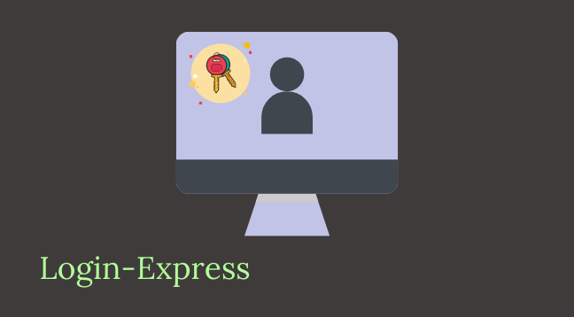

# LOGIN COMPLETO CON EXPRESS

## Guía paso a paso... punto de partida

Para poder seguir este paso a paso tu proyecto deberá contar con lo siguiente:
- Un proyecto con Node.js y Express instalado y funcionando.
- Una estructura MVC donde existan ruteadores y controladores.
- Vistas con EJS o cualquier otro motor de plantillas.
Para este ejemplo vamos a imaginar que estamos validando el registro de un usuario.

## Paso 1: Habilitar las sesiones
Para hacer funcionar el login, lo primero que tendremos que tener habilitado es el uso de
las sesiones, para eso estaremos utilizando un módulo llamado Express Session. Para
instalarlo utilizaremos el mismo comando que utilizamos para módulos anteriores.

npm i express-session

A continuación, nos toca habilitar las sesiones, para eso trabajaremos en el app.js (o el
archivo que tengamos como punto de entrada). Donde como primer paso requeriremos
el módulo de sesiones y como segundo paso las habilitaremos en la configuración de
Express.

const session = require('express-session');

app.use(session({
secret: 'Nombre del sitio',
resave: false,
saveUninitialized: true,
}));

## Paso 2: Habilitar las cookies
Adicionalmente para funcionalidades algo más avanzadas, como recordar al usuario,
estaremos manejando cookies y por eso necesitamos un módulo llamado Cookie
Parser. La instalación es como la del resto de los módulos:

npm i cookie-parser

Luego, en nuestro punto de entrada agregaremos el siguiente código:

const session = require('express-session');

app.use(cookieParser())

## Paso 3: Habilitar la encriptación de datos
Por último, nuestro login no estaría completo si no nos encargamos de implementar un
guardado seguro de contraseñas.

Seguramente este paso ya lo hayas hecho al momento de implementar el registro de
usuarios. En caso de que no lo hayas hecho, estos son los pasos a seguir.

npm i bcryptjs

Para encriptar un dato:

let hash = bcrypt.hashSync('¡miContraseña!');

Para verificar un dato:

bcrypt.compareSync("¡miContraseña!", hash); // true

bcrypt.compareSync("otraContraseña", hash); // false

## Paso 4: Rutas, controlador y vista del login
Para poder recibir los datos del usuario será necesario que contemos con:

1- Una vista que contenga los datos que usaremos para que el usuario ingrese:
- Su e-mail (podría ser un usuario también).
- Su contraseña.

2- La ruta que muestre el formulario de login, podría ser /users/login

3- El método del controlador que procese esa ruta.

## Paso 5: Validar los datos
Si bien no es específico del login, la validación debe estar presente en todos los lugares
donde recibamos información de parte del usuario.

## Paso 6: Verificar el usuario y la contraseña
Ahora que ya sabemos que los datos enviados son seguros, vamos a verificar que el
usuario exista y, si ese es el caso, que la contraseña corresponda con la que tenemos en
nuestra base de datos

## Paso 7: Guardar el usuario en la sesión
Si todos los datos anteriores son correctos, quiere decir que nuestro usuario ha ingresado
correctamente. En este caso, debemos recordar que el usuario está logueado mientras
dure su sesión.

## Paso 8: Crear los middlewares de autenticación
Ahora que podemos saber si el usuario existe o no en sesión, es hora de permitir que
nuestro sitio tenga rutas a las que solo puedan acceder los usuarios logueados.

Paso extra: recordar al usuario

Siempre es útil que el sitio nos recuerde, en caso de que no queramos ingresar nuestros
datos de acceso cada vez que visitemos el sitio.
Para eso pondremos en uso el segundo módulo que instalamos al iniciar esta guía.

## Conclusión
Si bien el uso de middlewares parece complejo al principio, simplifica y evita el desarrollo
de una gran lógica de validación que deberíamos implementar si no los utilizáramos.
¡Hasta la próxima!

## Ubicación -> PROGRAMACIÓN/TRABAJOS PRACTICOS/Login-Express